Keyes 24合1 传感器套件 for Arduino

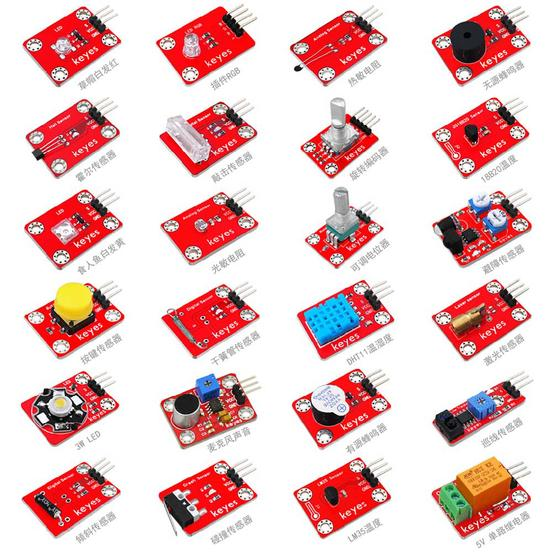


# 说明

这款套件包含我们玩单片机时常用到的24款传感器模块，如有源蜂鸣器模块、5V继电器模块、温湿度传感器等等。它适用于各种单片机和树莓派。同时我们为套件里的每一款传感器都编写了资料，资料里介绍了传感器模块基于Arduino开发板的使用方法，包含了接线方法、测试代码、实验结果等信息。

# 清单

|编码|名称|描述|数量|图片|
|-|-|-|-|-|
|1|Keyes模块|keyes 草帽LED白发白模块(焊盘孔) 红色 环保|1||
|2|Keyes模块|keyes 干簧管(焊盘孔) 红色 环保|1||
|3|Keyes模块|keyes 食人鱼LED黄光模块(焊盘孔) 红色 环保|1||
|4|Keyes模块|keyes 3W LED模块(焊盘孔) 红色 环保|1|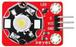|
|5|Keyes模块|keyes 有源蜂鸣器模块焊盘孔) 红色 环保|1|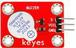|
|6|Keyes模块|keyes 无源蜂鸣器模块(焊盘孔) 红色 环保|1||
|7|Keyes模块|keyes 旋转编码器模块(焊盘孔) 红色 环保|1||
|8|Keyes模块|keyes 可调电位器模块(焊盘孔) 红色 环保|1||
|9|Keyes模块|keyes 5V 单路继电器模块(焊盘孔) 红色 环保|1|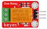|
|10|Keyes模块|keyes 插件RGB(焊盘孔) 红色 环保|1|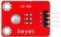|
|11|keyes传感器|keyes 热敏电阻传感器(焊盘孔) 红色 环保|1|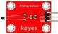|
|12|keyes传感器|keyes 按键传感器(焊盘孔) 红色 环保|1|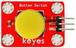|
|13|keyes传感器|keyes DHT11温湿度传感器(焊盘孔) 红色 环保|1|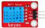|
|14|keyes传感器|keyes 光敏电阻传感器(焊盘孔) 红色 环保|1||
|15|keyes传感器|keyes 倾斜模块传感器(焊盘孔) 红色 环保|1|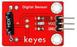|
|16|keyes传感器|keyes 麦克风声音传感器(焊盘孔) 红色 环保|1|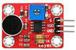|
|17|keyes传感器|keyes 霍尔传感器(焊盘孔) 红色 环保|1|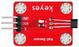|
|18|keyes传感器|keyes 碰撞传感器(焊盘孔) 红色 环保|1|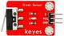|
|19|keyes传感器|keyes 敲击模块传感器(焊盘孔) 红色 环保|1|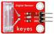|
|20|keyes传感器|keyes 避障传感器(焊盘孔) 红色 环保|1|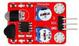|
|21|keyes传感器|keyes LM35温度传感器(焊盘孔) 红色 环保|1||
|22|keyes传感器|keyes 激光头传感器模块(焊盘孔) 红色 环保|1|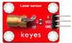|
|23|keyes传感器|keyes 巡线传感器(焊盘孔) 红色 环保|1||
|24|keyes传感器|keyes 18B20温度传感器(焊盘孔) 红色 环保|1|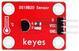|

# Arduino IDE和驱动的安装

当我们拿到开发板时，首先我们要安装Arduino IDE和驱动，相关文件我们可以在官网上找到，以下链接是包含各种系统、各种版本的Arduino IDE和驱动任你选择。

<https://www.arduino.cc/en/Main/OldSoftwareReleases#1.5.x>

下面我们介绍下Arduino-1.5.6 版本IDE在Windows系统的安装方法。

下载下来的文件是一个arduino-1.5.6-r2-windows.zip的压缩文件夹，解压出来到硬盘。

双击Arduino-1.5.6 .exe文件


然后

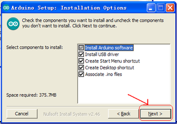

然后

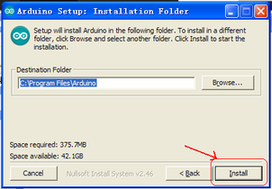

等待安装完成.点击close，安装完成。

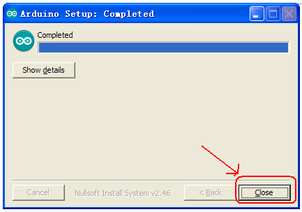

1.5.6版本安装后的样子。

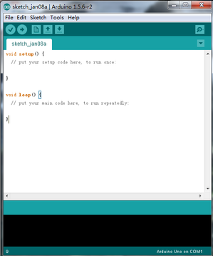

接下来是开发板驱动的安装，这次我们安装的是Keyes UNO R3
开发板的驱动，Keyes 2560 R3
开发板安装驱动方法和这个类似，驱动文件可以用同一个文件。

不同的系统，安装驱动的方法也有一些细小的区别，下面我们介绍在WIN 7系统安装驱动的方法。

第一次Keyes UNO R3
开发板连接电脑时，点击计算机--属性--设备管理器，显示如下图。

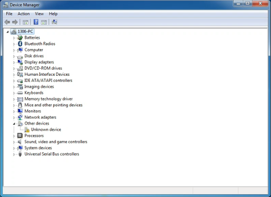

点击 Unknown device 安装驱动，如下图。

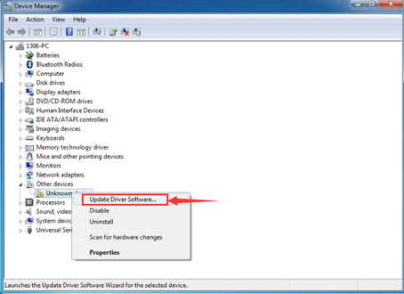

进入下图，选择

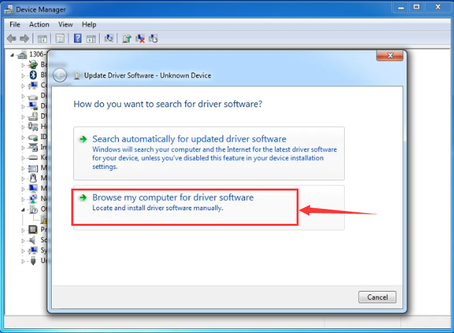

找到Arduino安装位置的drivers文件夹

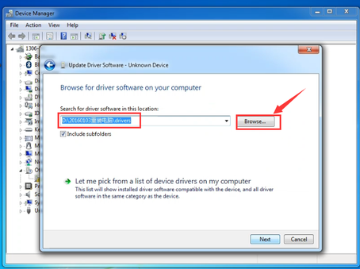

点击“Next”，今天下图选择，开始安装驱动

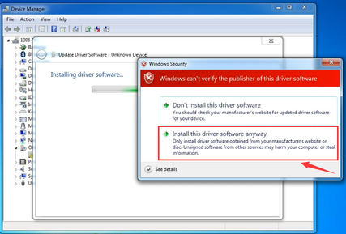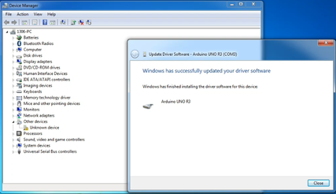

安装驱动完成，出现下图点击Close。

这样驱动就装好了。点击计算机--属性--设备管理器，我们可看见如下图。

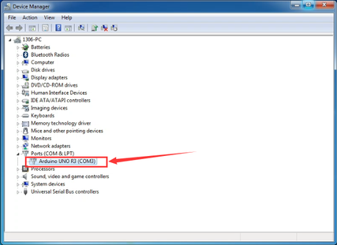

# Arduino IDE的使用方法

Keyes UNO R3
开发板的USB驱动安装成功之后，我们可以在Windows设备管理器中找到相应的串口。

下面示范第一个程序的烧写，串口监视器中显示“Hello World！”。

测试代码为：

```
int val;
int ledpin=13; 
void setup()
{
Serial.begin(9600);
pinMode(ledpin,OUTPUT);
}
void loop()
{
val=Serial.read();
if(val=='R')
{
digitalWrite(ledpin,HIGH);
delay(500);
digitalWrite(ledpin,LOW);
delay(500);
Serial.println("Hello World!");
}
}
```


我们打开Arduino 的软件，编写一段程序让Keyes UNO R3开发板接受到我们发的指令就显示“Hello World！”字符串；我们再借用一下Keyes UNO R3 开发板上的 D13的指示灯，让Keyes UNO R3
开发板接受到指令时指示灯闪烁一下，再显示“Hello World！”。

打开Arduino 的软件，设置板，如下。


设置COM端口，如下

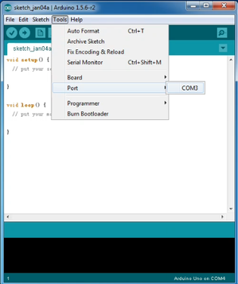

点击编译程序，检查程序是否错误；点击上传程序；Keyes UNO R3 开发板设置OK后右下脚显示如下图，和设备管理器中显示一致。

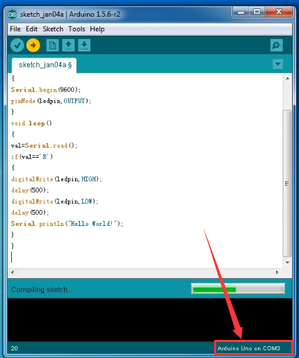

上传成功，输入R，点击发送，Keyes UNO R3 开发板上的 D13的指示灯闪烁一次，串口监视器中显示 Hello World! 如下图

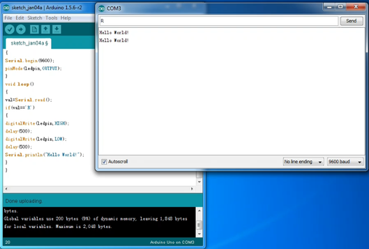

那么恭喜你，你的第一个程序已经成功了！！！

# 实验课程

## 实验一 LED模块 

实验说明

本实验我们主要用来检测LED模块。实验中我们将LED模块的信号端接在开发板数字口3上，它同时也是PWM口。我们用两个实验检测，一个是让LED进行闪烁实验;另一个是让PWM口控制LED的亮度，让LED逐渐变亮和逐渐变暗，模拟人体呼吸的现象。

实验器材

开发板\*1

USB线\*1

LED模块\*1

（草帽LED模块、食人鱼LED模块和3W LED模块都可以）

杜邦线若干

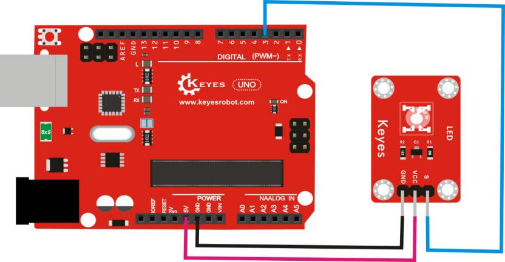

测试代码

代码A:

int led = 3; //定义数字口3

void setup()

{

  pinMode(led, OUTPUT);     //设置led为输出

}

void loop()

{

  digitalWrite(led, HIGH);   //开启led

  delay(1000); //延迟1秒

  digitalWrite(led, LOW);    //关闭led

  delay(1000);//延迟1秒

}

代码B:

int ledPin = 3; // 定义数字口3

void setup()

{

pinMode(ledPin, OUTPUT);// 将ledPin设置为输出

}

void loop()

{

for (int a=0; a\<=255;a++)// 设置使LED逐渐变亮

{

analogWrite(ledPin,a); //
开启led,调节亮度，范围是0-255，在255时led最亮

delay(10); // 延迟0.01秒

}

for (int a=255; a\>=0;a--) // 设置使LED逐渐变暗

{

analogWrite(ledPin,a); //
开启led,调节亮度，范围是0-255，在255时led最亮

delay(10); // 延迟0.01秒

}

delay(1000);// 延迟1秒

}

测试结果

上传完代码A，上电后，我们就可以看到LED不停闪烁，间隔大约为1秒。上传完代码B，上电后，我们就可以看到LED先逐渐变亮，后逐渐变暗，循环交替。

## 实验二 干簧管模块 

实验说明

本实验我们主要用来检测干簧管模块。该模块主要由干簧管组成，模块接上电源后，信号端输出为高电平，传感器上LED变暗；当给模块施加一个磁场时信号端输出为低电平，传感器上LED变亮。实验中我们用到了Arduino UNO 板上自带的D13 的指示灯，通过传感器，控制D13 的指示灯的亮灭。

实验器材

开发板\*1

USB线\*1

干簧管模块\*1

杜邦线若干

接线图


测试代码

int Led=13;//定义数字口13

int buttonpin=3; //定义数字口3

int val;//定义数字变量val

void setup()

{

pinMode(Led,OUTPUT);//将Led设置为输出

pinMode(buttonpin,INPUT);//将buttonpin设置为输入

}

void loop()

{

val=digitalRead(buttonpin);// 读取数字口3的数值，并赋值给val

if(val==LOW)//当val为高电平时

{

digitalWrite(Led,HIGH); //LED亮起

}

else

{

digitalWrite(Led,LOW); //LED熄灭

}

}

测试结果

按照上图接好线，上传好代码，上电后，Arduino UNO 板上的 D13
的指示灯熄灭，模块上D1灯熄灭；当有磁铁靠近模块时， Arduino UNO 板上的
D13 的指示灯亮起，模块上D1灯亮。

## 实验三 有源蜂鸣器模块

实验说明

本实验我们主要用来检测有源蜂鸣器模块。它主要由有源蜂鸣器组成，是一种一体化结构的电子讯响器，采用直流电源供电。模块接上电源后，当我们直接给信号端输入个高电平信号后，蜂鸣器响起。实验中我们让有源蜂鸣器模块循环响起，关闭。

实验器材

开发板\*1

USB线\*1

有源蜂鸣器模块\*1

杜邦线若干

接线图

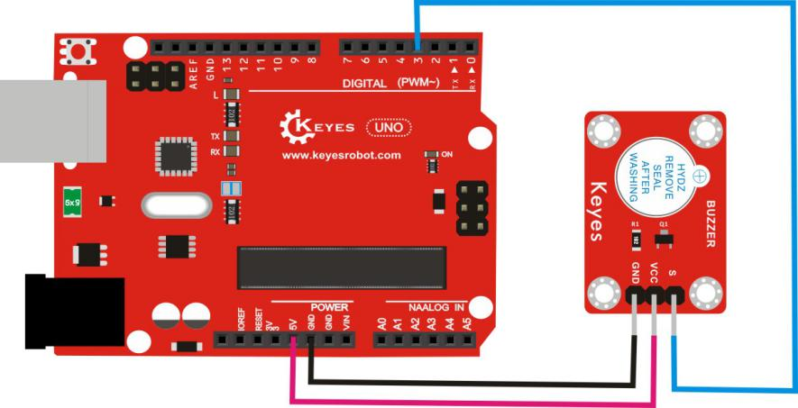

测试代码

int buzzPin = 3;    //定义数字口3

 void setup() 

 {       

  pinMode(buzzPin, OUTPUT);  //将buzzPin设置为输出

}

 void loop()                    

{

  digitalWrite(buzzPin, HIGH);//有源蜂鸣器响起

  delay(2000); //延迟2秒

  digitalWrite(buzzPin, LOW); //有源蜂鸣器关闭

  delay(2000);  //延迟2秒     

}

测试结果

有源蜂鸣器只需要有个高电平电压蜂鸣器就响起。上传好代码，连接好线，上电后，有源蜂鸣器响2秒，静音2秒，循环交替。

## 实验四 无源蜂鸣器模块 

实验说明

本实验我们主要用来检测草无源蜂鸣器模块。蜂鸣器可分为有源蜂鸣器和无源蜂鸣器两种。无源蜂鸣器内部不带振荡源，直流信号无法令其鸣叫，须用方波驱动。

实验中我们将无源蜂鸣器模块的信号端接在开发板的数字口3上，通过开发板控制数字口3输出方波，从而驱动无源蜂鸣器。我们用两个实验检测，一个是让数字口3循环输出两种频率的方波，驱动无源蜂鸣器响起;另一个是我们让数字口3输出各种频率的方波，并且设定好节奏，从而让无源蜂鸣器播放《欢乐颂》的曲子。

实验器材

开发板\*1

USB线\*1

无源蜂鸣器模块\*1

杜邦线若干

接线图

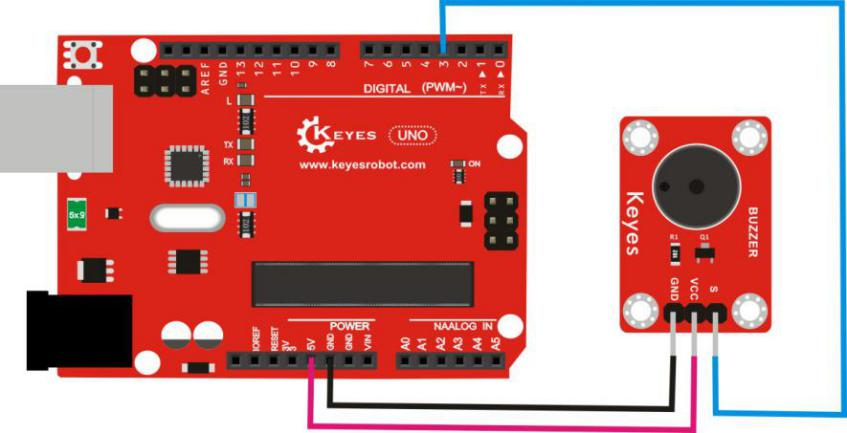

测试代码

代码A:

int buzzer=3; //定义数字口3

void setup()

{

pinMode(buzzer,OUTPUT);//将buzzer设置为输出

}

void loop()

{

unsigned char i,j;//定义变量i，j

while(1)

{

for(i=0;i\<80;i++)// 输出一个频率的声音

{

digitalWrite(buzzer,HIGH);

delay(1);//延迟1ms

digitalWrite(buzzer,LOW);

delay(1);//延迟1ms

}

for(i=0;i\<100;i++)// 输出另一个频率的声音

{

digitalWrite(buzzer,HIGH);

delay(2);//延迟2ms

digitalWrite(buzzer,LOW);

delay(2);//延迟2ms

}

}

}

代码B:

\#define D0 -1

\#define D1 262

\#define D2 293

\#define D3 329

\#define D4 349

\#define D5 392

\#define D6 440

\#define D7 494

\#define M1 523

\#define M2 586

\#define M3 658

\#define M4 697

\#define M5 783

\#define M6 879

\#define M7 987

\#define H1 1045

\#define H2 1171

\#define H3 1316

\#define H4 1393

\#define H5 1563

\#define H6 1755

\#define H7 1971

//列出全部D调的频率

\#define WHOLE 1

\#define HALF 0.5

\#define QUARTER 0.25

\#define EIGHTH 0.25

\#define SIXTEENTH 0.625

//列出所有节拍

int tune\[\]= //根据简谱列出各频率

{

M3,M3,M4,M5,

M5,M4,M3,M2,

M1,M1,M2,M3,

M3,M2,M2,

M3,M3,M4,M5,

M5,M4,M3,M2,

M1,M1,M2,M3,

M2,M1,M1,

M2,M2,M3,M1,

M2,M3,M4,M3,M1,

M2,M3,M4,M3,M2,

M1,M2,D5,D0,

M3,M3,M4,M5,

M5,M4,M3,M4,M2,

M1,M1,M2,M3,

M2,M1,M1

};

float durt\[\]= //根据简谱列出各节拍

{

1,1,1,1,

1,1,1,1,

1,1,1,1,

1+0.5,0.5,1+1,

1,1,1,1,

1,1,1,1,

1,1,1,1,

1+0.5,0.5,1+1,

1,1,1,1,

1,0.5,0.5,1,1,

1,0.5,0.5,1,1,

1,1,1,1,

1,1,1,1,

1,1,1,0.5,0.5,

1,1,1,1,

1+0.5,0.5,1+1,

};

int length;

int tonepin=3; //得用3号接口

void setup()

{

pinMode(tonepin,OUTPUT);

length=sizeof(tune)/sizeof(tune\[0\]); //计算长度

}

void loop()

{

for(int x=0;x\<length;x++)

{

tone(tonepin,tune\[x\]);

delay(500\*durt\[x\]);
//这里用来根据节拍调节延时，500这个指数可以自己调整，在该音乐中，我发现用500比较合适。

noTone(tonepin);

}

delay(2000);

}

测试结果

上传完代码A，上电后，无源蜂鸣器会发出两种不同的声音，两种声音循环交替。上传完代码B，上电后，无源蜂鸣器会想响起《欢乐颂》的曲子。

## 实验五 旋转编码器模块

实验说明

本实验我们主要用来检测旋转编码器模块。它主要由旋转编码器组成，它可通过旋转可以计数正方向和反方向转动过程中输出脉冲的次数，这种转动计数是没有限制的，复位到初始状态，即从0开始计数。实验中我们利用一个旋转编码器模块控制两个草帽LED的亮灭。

实验器材

开发板\*1

USB线\*1

旋转编码器模块\*1

LED模块\*2

杜邦线若干

接线图

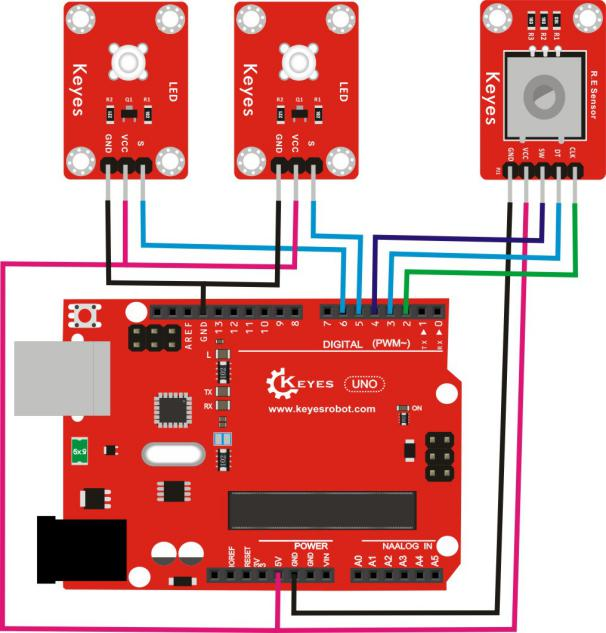

测试代码

const int interruptA = 0; //中断0就是在数字口2

const int interruptB = 1;//中断1就是在数字口3

int CLK = 2; // 定义数字口2

int DAT = 3; // 定义数字口3

int BUTTON = 4; // 定义数字口4

int LED1 = 5; // 定义数字口5

int LED2 = 6; // 定义数字口6

int COUNT = 0;//设置数字变量COUNT为0

void setup()

{

attachInterrupt(interruptA, RoteStateChanged, FALLING);

// 当数字口2由高电平变为低电平时，触发中断。

pinMode(CLK, INPUT);//设置CLK为输入

digitalWrite(2, HIGH); // 设置数字口2为高电平

pinMode(DAT, INPUT); //设置DAT为输入

digitalWrite(3, HIGH); //设置数字口3为高电平

pinMode(BUTTON, INPUT); //设置BUTTON为输入

digitalWrite(4, HIGH); //设置数字口4为高电平

pinMode(LED1, OUTPUT);//设置LED1为输出

pinMode(LED2, OUTPUT);//设置LED1为输出

Serial.begin(9600); //设置波特率

}

void loop()

{

if (digitalRead(BUTTON)==LOW)//当数字口4为低电平时

{

COUNT = 0; //设置数字变量COUNT为0

Serial.println("STOP COUNT = 0");//显示对于内容

digitalWrite(LED1, LOW);//LED1变暗

digitalWrite(LED2, LOW);//LED2变暗

delay (2000);//延迟2S

}

Serial.println(COUNT);//显示COUNT数据

}

void RoteStateChanged() //当数字口2由高电平变为低电平时

{

if (digitalRead(DAT)==HIGH) // 当数字口3为高电平时

{

COUNT++;//数字变量COUNT加1

digitalWrite(LED1, HIGH);//LED1亮起

digitalWrite(LED2, LOW);//LED2变暗

delay(200);//延迟0.2S

}

else

{

COUNT--;//数字变量COUNT减1

digitalWrite(LED2, HIGH);//LED2亮起

digitalWrite(LED1, LOW);//LED1变暗

delay(200);//延迟0.2S

}

}

测试结果

上传好代码，连接好线，上电后，我们可以通过旋转旋转编码器，可以随意控制两个草帽LED的亮灭。

## 实验六 可调电位器模块

实验说明

本实验我们主要用来检测可调电位器模块。它主要由可调电位器组成，模块上电后，我们只需旋转模块上电位器就可以调节模拟输入数值。实验中将模块的S端接到开发板的模拟口A0，在Arduino IDE的串口监视器上可看到对应的模拟值显示。

实验器材

开发板\*1

USB线\*1

可调电位器模块\*1

杜邦线若干

接线图

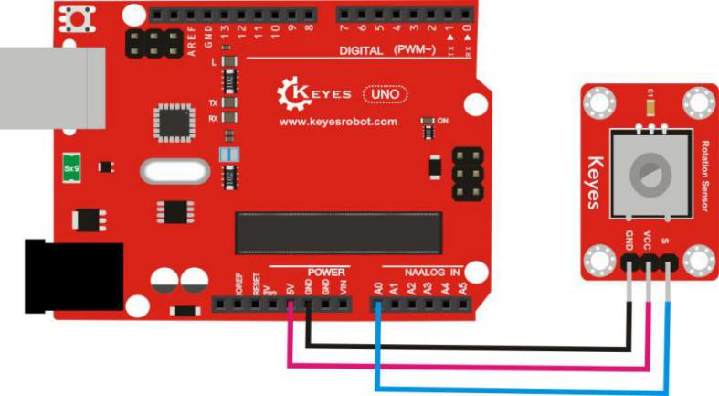

测试代码

int sensorPin =A0 ; //定义模拟口A0

int value = 0; //设置value为0

void setup()

{

Serial.begin(9600);//设置波特率

}

void loop()

{

value = analogRead(sensorPin); //将value设置为读取到的A0的数值

Serial.println(value, DEC); //显示value数值，并自动换行

delay(100); //延迟0.1秒

}

测试结果

按照上图接好线，烧录好代码，上电后，我们可以在软件的串口监视器中看到模拟口A0模拟值，旋转旋钮，数据变化，变化范围在
0-1023，如下图。

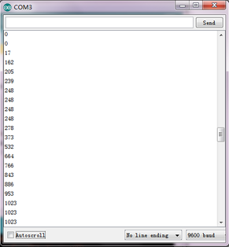

## 实验七 5V单路继电器模块 

实验说明

本实验我们主要用来检测5V
单路继电器模块。这个继电器模块是高电平有效，我们把继电器模块的信号端接在数字口3。实验中我们通过开发板控制数字口3，控制模块上继电器循环开启和关闭。

实验器材

开发板\*1

USB线\*1

5V 单路继电器模块\*1

杜邦线若干

接线图

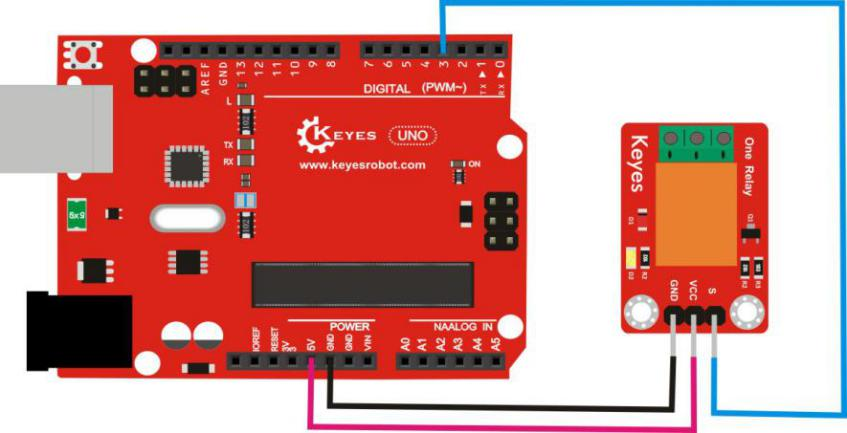

测试代码

int Relay = 3; //定义数字口3

void setup()

{

pinMode(Relay, OUTPUT); //将Relay设置为输出

}

void loop()

{

digitalWrite(Relay, HIGH); //打开继电器

delay(2000); //延时2秒

digitalWrite(Relay, LOW); //关闭继电器

delay(2000); //延时2秒

}

测试结果

按照上图接好线，上传好代码，上电后，继电器开启（ON端连通，NC断开）2秒，停止（ON端断开，NC端连通）2秒，循环交替，开启时继电器上D2灯亮起。

## 实验八 插件RGB模块

实验说明

本实验我们主要用来检测插件RGB模块。本模块由主要一个插件全彩LED制成，通过
R、 G、
B三个引脚的PWM电压输入可以调节三种基色（红/蓝/绿）的强度从而实现全彩的混色效果。我们用Arduino对模块的控制可实现酷炫的灯光效果。实验中我们让插件RGB模块循环显示不同颜色。

实验器材

开发板\*1

USB线\*1

插件RGB模块\*1

杜邦线若干

接线图

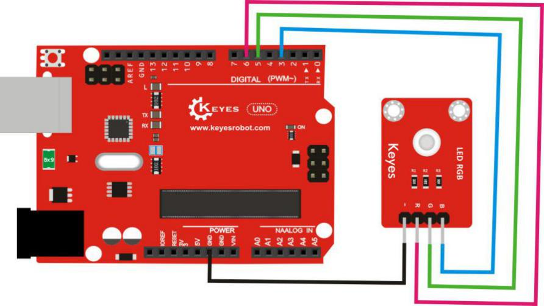

测试代码

int redPin = 6; // R 红色LED 控制引脚 连接到Arduino的 6脚

int greenPin = 5; // G绿色LED 控制引脚 连接到Arduino的5脚

int bluePin = 3; // B蓝色LED 控制引脚 连接到Arduino的3脚

void setup()

{

pinMode(redPin, OUTPUT); //设置redPin对应的管脚6为输出

pinMode(greenPin, OUTPUT); //设置greenPin,对应的管脚5为输出

pinMode(bluePin, OUTPUT); //设置bluePin对应的管脚3为输出

}

void loop() // run over and over again

{

// Basic colors:

color(255, 0, 0); // 红色亮

delay(1000); // 延时一秒

color(0,255, 0); //绿色亮

delay(1000); //延时一秒

color(0, 0, 255); // 蓝色灯亮

delay(1000); //延时一秒

// Example blended colors:

color(255,255,0); // 黄色亮

delay(1000); //延时一秒

color(128,0,255); // 紫色亮

delay(1000); //延时一秒

color(255,255,255); // 白色亮

delay(1000); //延时一秒

color(0,0,0); // 关闭led

delay(1000); //延时一秒

}

void color (unsigned char red, unsigned char green, unsigned char blue) //颜色控制函数

{

analogWrite(redPin, red);

analogWrite(greenPin,green);

analogWrite(bluePin, blue);

}

测试结果

上传完代码，上电后
，RGB模块会陆续显示红色1秒，绿色1秒，蓝色1秒，黄色1秒，紫色1秒，白色1秒，停止显示1秒，然后循环交替。

## 实验九 热敏电阻传感器

实验说明

本实验我们主要用来检测热敏电阻传感器。它是基于热敏电阻的工作原理，能够实时感知周边环境温度的变化，我们把数据送到
Arduino的模拟口，接来下我们只要经过简单的编程就能将传感器输出的数据转换为摄氏温度值，并加以显示，借此广泛应用于园艺、家庭警报系统等装置中。

实验中将传感器的信号端接到开发板的模拟口A0，在Arduino IDE的串口监视器上可看到当前环境中的温度值。

实验器材

开发板\*1

USB线\*1

热敏电阻传感器\*1

杜邦线若干

接线图

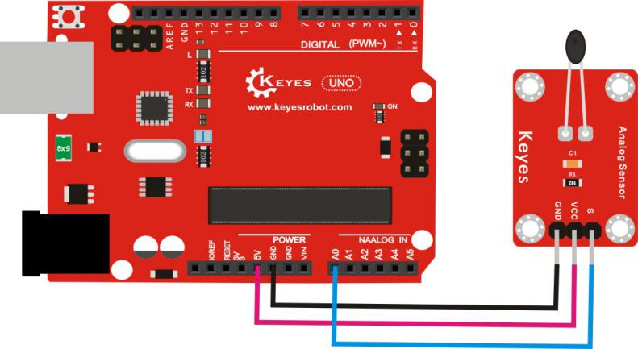

测试代码

\#include \<math.h\>

double Thermister(int RawADC) {

double Temp;

Temp = log(((10240000/RawADC) - 10000));

Temp = 1 / (0.001129148 + (0.000234125 + (0.0000000876741 \* Temp \*
Temp ))\* Temp );

Temp = Temp - 273.15; // Convert Kelvin to Celcius

return Temp;

}

void setup()

{

Serial.begin(9600); //设置波特率

}

void loop()

{

Serial.print(Thermister(analogRead(0))); // 显示计算的温度值

Serial.println("c"); // 显示c，并自动换行

delay(500); // 延迟0.5S

}

测试结果

按照上图接好线，上传好代码，上电后，我们可以在软件的串口监视器中看到当前环境中的温度值，如下图。

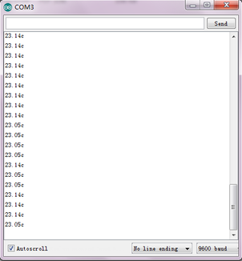

## 实验十 按键传感器

实验说明

本实验我们主要用来检测按键传感器。当我们按下按键时传感器信号端输出低电平信号，释放按键时传感器信号端保持高电平。实验中我们用到了Arduino UNO 板上自带的D13 的指示灯，通过传感器，控制D13 的指示灯的亮灭。

实验器材

开发板\*1

USB线\*1

按键传感器\*1

杜邦线若干

接线图

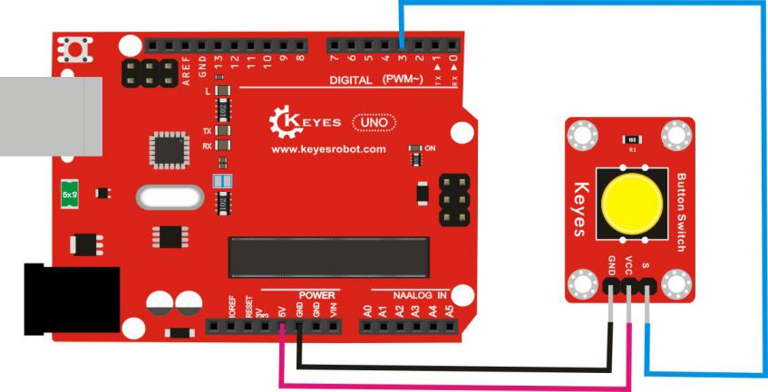

测试代码

int ledPin = 13; //定义数字口13

int inputPin = 3; //定义数字口3

void setup()

{

pinMode(ledPin, OUTPUT); //将ledPin设置为输出

pinMode(inputPin, INPUT); //将inputPin设置为输入

}

void loop()

{

int val = digitalRead(inputPin);

//设置数字变量val，读取到数字口3的数值，并赋值给 val

if (val == LOW) //当val为低电平时，LED亮起

{

digitalWrite(ledPin, HIGH); // LED亮起

}

else

{

digitalWrite(ledPin, LOW); // LED变暗

}

}

测试结果

按照上图接好线，上传好代码，上电后，按下传感器按键后， Arduino UNO
板上的 D13 的指示灯亮起，释放传感器按键后， Arduino UNO 板上的 D13
的指示灯熄灭。

## 实验十一 DHT11温湿度传感器

实验说明

本实验我们主要用来检测DHT11温湿度传感器。它是一款含有已校准数字信号输出的温湿度复合传感器，它应用专用的数字模块采集技术和温湿度传感技术，确保产品具有极高的可靠性和卓越的长期稳定性。

实验中将传感器的信号端接到开发板的数字口3，在Arduino IDE的串口监视器上可看到当前环境中的温度值和湿度值。

实验器材

开发板\*1

USB线\*1

DHT11温湿度传感器\*1

杜邦线若干

接线图

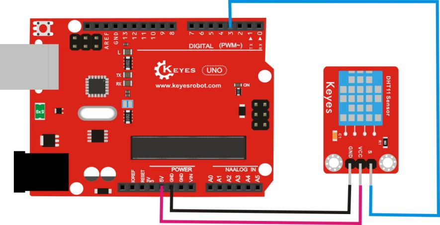

测试代码

\#include \<dht11.h\>

dht11 DHT;

\#define DHT11_PIN 3

void setup(){

Serial.begin(9600);

Serial.println("DHT TEST PROGRAM ");

Serial.print("LIBRARY VERSION: ");

Serial.println(DHT11LIB_VERSION);

Serial.println();

Serial.println("Type,\tstatus,\tHumidity (%),\tTemperature (C)");

}

void loop(){

int chk;

Serial.print("DHT11, \t");

chk = DHT.read(DHT11_PIN); // READ DATA

switch (chk){

case DHTLIB_OK:

Serial.print("OK,\t");

break;

case DHTLIB_ERROR_CHECKSUM:

Serial.print("Checksum error,\t");

break;

case DHTLIB_ERROR_TIMEOUT:

Serial.print("Time out error,\t");

break;

default:

Serial.print("Unknown error,\t");

break;

}

// DISPLAT DATA

Serial.print(DHT.humidity,1);

Serial.print(",\t");

Serial.println(DHT.temperature,1);

delay(1000);

}

库文件下载地址

<https://pan.baidu.com/s/1eSlMYD8>

测试结果

按照上图接好线，上传好代码，上电后，我们可在软件串口监视器中看到当前环境中的温度值和湿度值，如下图。

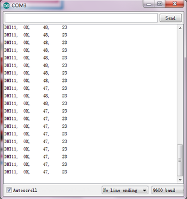

## 实验十二 光敏电阻传感器

实验说明

本实验我们主要用来检测光敏电阻传感器。这个传感器对环境光线最敏感，一般用来检测周围环境的光线的亮度，触发单片机或继电器模块等。实验中将传感器的信号端接到开发板的模拟口A0，在Arduino IDE的串口监视器上可看到对应的模拟值输出。

实验器材

开发板\*1

USB线\*1

光敏电阻传感器\*1

杜邦线若干

接线图


测试代码

int sensorPin =A0 ; //定义模拟口A0

int value = 0; //设置value为0

void setup()

{

Serial.begin(9600); //设置波特率

}

void loop()

{

value = analogRead(sensorPin); //将value设置为读取到的A0的数值

Serial.println(value, DEC); //显示value数值，并自动换行

delay(200); //延迟0.2秒

}

测试结果

按照上图接好线，上传好代码，上电后，我们可以在软件的串口监视器中看到代表当前光线强弱的模拟值，光线越强，数值越大，如下图。

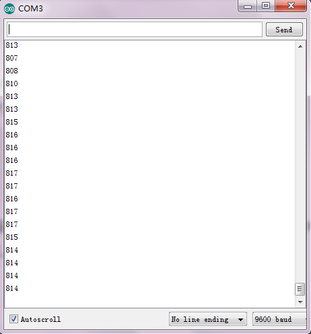

## 实验十三 倾斜模块传感器

实验说明

本实验我们主要用来检测倾斜模块传感器。这个传感器主要是利用滚珠在开关内随不同倾斜角度的发化，达到触发电路的目的；可用于倾斜检测、报警器制作或者其他检测。实验中我们用到了Arduino UNO 板上自带的D13 的指示灯，通过传感器，控制D13 的指示灯的亮灭。

实验器材

开发板\*1

USB线\*1

倾斜模块传感器\*1

杜邦线若干

接线图

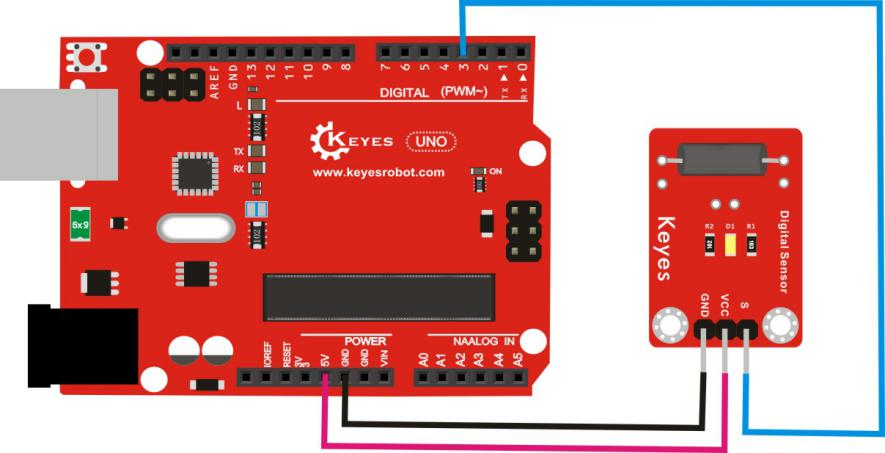

测试代码

int ledPin = 13; //定义数字口13

int switcher = 3; // 定义数字口3

void setup()

{

pinMode(ledPin, OUTPUT); // 将ledPin设置为输出

pinMode(switcher, INPUT); //将switcher设置为输入

}

void loop()

{

if(digitalRead(switcher)==HIGH) //当读取数字口3，并发现为高电平

{

digitalWrite(ledPin, HIGH); // LED亮起

}

else

{

digitalWrite(ledPin, LOW); // LED变暗

}

}

测试结果

按照上图接好线，上传好代码，上电后，倾斜一方时 Arduino UNO 板上的 D13
的指示灯亮，数字倾斜模块上D1灯灭；倾斜另一方时 Arduino UNO 板上的 D13
的指示灯灭，数字倾斜模块上D1灯亮。

## 实验十四 麦克风声音传感器

实验说明

本实验我们主要用来检测麦克风声音传感器。这个传感器的S端是模拟输出，是麦克风的电压信号实时输出，通过电位器可调节信号增益。实验中将传感器的S端接到开发板的模拟口A0，在Arduino IDE的串口监视器上可看到对应的模拟值输出。

实验器材

开发板\*1

USB线\*1

麦克风声音传感器\*1

杜邦线若干

接线图

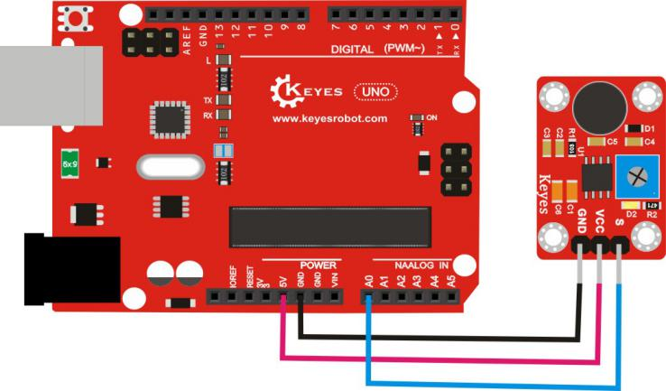

测试代码

int sensorPin =A0 ; //定义模拟口A0

int value = 0; //设置value为0

void setup()

{

Serial.begin(9600); //设置波特率

}

void loop()

{

value = analogRead(sensorPin); //将value设置为读取到的A0的数值

Serial.println(value, DEC); //显示value数值，并自动换行

delay(100); //延迟0.1秒

}

测试结果

按照上图接好线，上传好代码，上电后，我们可以在软件的串口监视器相对应模拟值，如下图。声音越大模拟值越大。

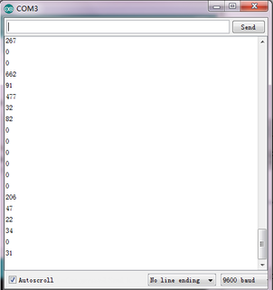

## 实验十五 霍尔传感器

实验说明

本实验我们主要用来检测霍尔传感器。传感器输入为磁感应强度，输出是一个数字电压信号。它具有体积小、灵敏度高、响应速度快、温度性能好、可靠性高等特点。产品可用于无触点开关、位置转速检测与控制、全报警装置、纺织控制系统等方面。实验中我们用到了Arduino UNO 板上自带的D13 的指示灯，通过传感器，控制D13 的指示灯的亮灭。

实验器材

开发板\*1

USB线\*1

霍尔传感器\*1

杜邦线若干

接线图

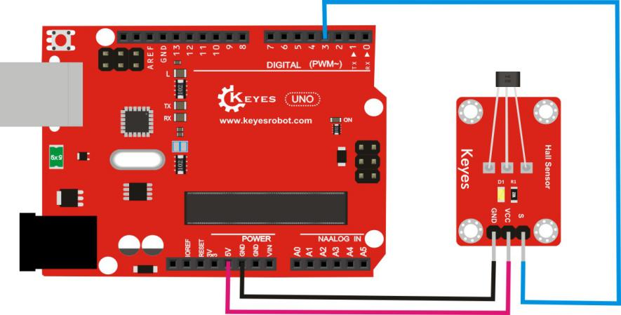

测试代码

int ledPin = 13; //定义数字口13

int inputPin = 3; //定义数字口3

int val = 0; //定义数字变量val，并设为0

void setup()

{

pinMode(ledPin, OUTPUT); //将ledPin设置为输出

pinMode(inputPin, INPUT); //将inputPin设置为输入

}

void loop(){

val = digitalRead(inputPin); //读取到数字口3的数值，并赋值给val

if (val == LOW) //当val为低电平时，LED亮起

{

digitalWrite(ledPin, HIGH); //LED亮起

}

else

{

digitalWrite(ledPin, LOW); //LED变暗

}

}

测试结果

按照上图接好线，上传好代码后，上电后，Arduino UNO 板上的 D13
的指示灯关闭，模块上D1灯关闭；当有磁铁靠近模块时， Arduino UNO 板上的
D13 的指示灯亮起，模块上D1灯亮起。

## 实验十六 碰撞传感器

实验说明

本实验我们主要用来检测碰撞传感器。当传感器因碰撞物体按下按键时传感器信号端输出低电平信号，释放按键时传感器信号端保持高电平。该传感器可用于3D打印机内做限位开关。实验中我们用到了Arduino UNO 板上自带的D13 的指示灯，通过传感器，控制D13 的指示灯的亮灭。

实验器材

开发板\*1

USB线\*1

碰撞传感器\*1

杜邦线若干

接线图


测试代码

int Led=13;//定义 LED 接口

int Shock=3;//定义碰撞传感器接口

int val;//定义数字变量 val

void setup()

{

pinMode(Led,OUTPUT);//定义 LED 为输出接口

pinMode(Shock,INPUT);//定义碰撞击传感器为输出接口

}

void loop()

{

val=digitalRead(Shock);//将数字接口 3 的值读取赋给 val

if(val==LOW)//当碰撞传感器检测有信号时，LED 亮起

{

digitalWrite(Led,HIGH); //LED 亮起

}

else

{

digitalWrite(Led,LOW); //LED 变暗

}

}

测试结果

按照上图接好线，烧录好代码；上电后，将碰撞传感器的小铁片往下压，
Arduino UNO 板上的 D13 的指示灯亮起和碰撞模块上D1灯亮起，否则。Arduino UNO 板上的 D13 的指示灯熄灭和碰撞模块上D1灯熄灭。

## 实验十七 敲击模块传感器

实验说明

本实验我们主要用来检测敲击模块传感器。它主要由SW-280振动开关组成，是电感式接近开关，是在感应震动力大小将感应结果传递到电路装置,并使电路启动工作的电子开关。实验中我们用到了Arduino UNO 板上自带的D13 的指示灯，通过传感器，控制D13 的指示灯的亮灭。

实验器材

开发板\*1

USB线\*1

敲击模块传感器\*1

杜邦线若干

接线图

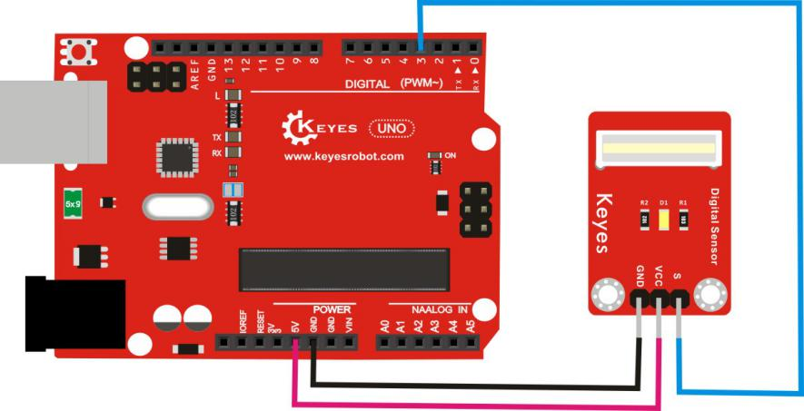

测试代码

int Led=13;//定义数字口13

int Shock=3;//定义数字口3

int val;//定义数字变量val

void setup()

{

pinMode(Led,OUTPUT);//将Led设置为输出

pinMode(Shock,INPUT);//将Shock设置为输入

}

void loop()

{

val=digitalRead(Shock);//读取到数字口3的数值，并赋值给val

if(val==LOW) //当val为低电平时，Led亮起

{

digitalWrite(Led,HIGH); //Led亮起

}

else

{

digitalWrite(Led,LOW); //Led变暗

}

}

测试结果

按照上图接好线，上传好代码，上电后，敲击该模块，Arduino UNO 板上的

D13 的 LED 指示灯和模块上 D1 灯亮起。

## 实验十八 避障传感器

实验说明

本实验我们主要用来检测避障传感器。接好线上电后，传感器感应到物体时信号端S输出0，未感应到时信号端S输出1。它可通过调节电位器用来调节感应灵敏度。它速度快，适合智能小车避障、黑白线循迹、防跌落，产品计数器，流水线切割，液位检测等。实验中我们用到了Arduino UNO 板上自带的D13 的指示灯，通过传感器，控制D13 的指示灯的亮灭。

实验器材

开发板\*1

USB线\*1

避障传感器\*1

杜邦线若干

接线图

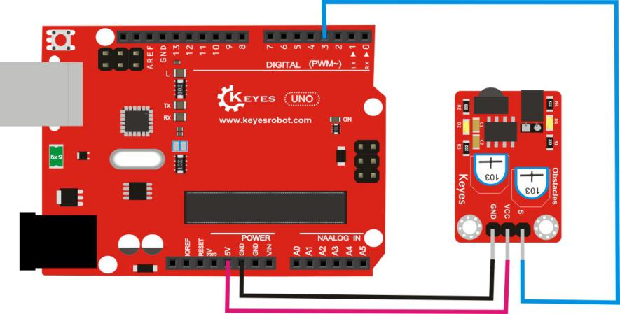

测试代码

const int sensorPin = 3; //定义数字口13

const int ledPin = 13; //定义数字口3

int sensorState = 0; //定义数字变量sensorState，并设为0

void setup()

{

pinMode(ledPin, OUTPUT); //将ledPin设置为输出

pinMode(sensorPin, INPUT);//将sensorPin设置为输入

}

void loop()

{

sensorState = digitalRead(sensorPin);

//读取到数字口3的数值，并赋值给sensorState

if (sensorState == LOW) //当sensorState为低电平时，LED亮起

{

digitalWrite(ledPin, HIGH);//LED亮起

}

else

{

digitalWrite(ledPin, LOW);//LED变暗

}

}

测试结果

按照上图接好线，上传好代码，上电后，通电后，靠近红外发射头的电位器顺时针调到尽头，再调节靠近红外接收头的电位器，观察D1灯，使D1灯关闭，并且保持将要亮起的临界点，此时感应距离最长。没有障碍物挡住红外避障传感器时，红外避障传感器上的D1灯关闭，Arduino UNO 板上的 D13
的指示灯关闭；当用障碍物挡住红外避障传感器，红外避障传感器上的D1灯亮起，Arduino UNO 板上的 D13 的指示灯亮起。

## 实验十九 LM35温度传感器

实验说明

本实验我们主要用来检测LM35温度传感器。它的输出电压与摄氏温标呈线性关系，转换公式如式，0时输出为0V，每升高1℃，输出电压增加10mV。

实验中将传感器的信号端接到开发板的模拟口A0，在Arduino IDE的串口监视器上可看到当前环境中的温度值。

实验器材

开发板\*1

USB线\*1

LM35温度传感器\*1

杜邦线若干

接线图


测试代码

void setup()

{

Serial.begin(9600);//设置波特率

}

void loop()

{

int val; //定义数字变量val

int dat;//定义数字变量dat

val=analogRead(0);//将val设置为读取到的A0的数值

dat=(500 \* val) /1024; //计算出当前温度数字dat

Serial.print("Temp:"); //显示 Temp:

Serial.print(dat); //显示计算的温度值

Serial.println("C");//显示C，并自动换行

delay(500); //延迟0.5S

}

测试结果

按照上图接好线，上传好代码，上电后，我们可以在软件的串口监视器中看到当前环境中的温度值，如下图。


## 实验二十 激光头传感器模块

实验说明

本实验我们主要用来检测激光头传感器模块。它主要由激光头组成，激光头由发光管芯、聚光透镜、铜可调套筒三部分组成。接上电源后，我们在信号端直接输入个高电平数字信号，传感器开始工作。它可用于激光类玩具、电子教鞭笔、电子水平尺、微型液晶投影等地方。实验中我们让激光头传感器模块循环开启，关闭。

实验器材

开发板\*1

USB线\*1

激光头传感器模块\*1

杜邦线若干

接线图


测试代码

void setup()

{

pinMode(3, OUTPUT); // 定义3脚为数字输出接口

}

void loop() {

digitalWrite(3, HIGH); // 打开激光头

delay(1000); // 延时一秒

digitalWrite(3, LOW); // 关闭激光头

delay(1000); // 延时一秒

}

测试结果

按照上图接好线，上传好代码，上电后，激光头打开1秒，关闭1秒，循环交替。

## 实验二十一 巡线传感器

实验说明

本实验我们主要用来检测巡线传感器。传感器上的TCRT5000红外对管的工作原理是利用红外线对颜色的反射率不一样，将反射信号的强弱转化成电流信号。传感器在检测到黑色高电平有效，检测到白色是为低电平有效，检测高度为
0—3cm。在电路中你可以使用旋钮电位器来调黑白寻迹的灵敏度。

实验中将传感器的S端接到开发板的数字口D3，在Arduino IDE的串口监视器上可看到对应的数值输出。

实验器材

开发板\*1

USB线\*1

巡线传感器\*1

杜邦线若干

接线图


测试代码

void setup()

{

Serial.begin(9600);//设置波特率

}

void loop()

{

Serial.println(digitalRead(3)); //输出从数字口3读取到的数值，并自动换行

delay(500);//延迟0.5秒

}

测试结果

按照上图接好线，上传好代码，上电后，传感器在检测到黑色时，信号端输出高电平，串口监视器显示1，传感器上D1指示灯熄灭；传感器在检测到其他颜色时，信号端输出低电平，串口监视器显示0，传感器上D1指示灯亮起。旋转电位器可调节灵敏度，将D1调节至亮与不亮的临界点时，灵敏度最高。


## 实验二十二 18B20温度传感器

实验说明

本实验我们主要用来检测18B20温度传感器。该传感器主要由DS18B20可编程数字温度器等组成，具有体积小，抗干扰能力强，精度高的特点。它的测温范围
－55℃～+125℃，固有测温误差是1℃。

实验中将传感器的信号端接到开发板的数字口3，在Arduino IDE的串口监视器上可看到当前环境中的温度值。

实验器材

开发板\*1

USB线\*1

18B20温度传感器\*1

杜邦线若干

接线图


测试代码

\#include \<OneWire.h\>

int DS18S20_Pin = 3; //定义数字口3

OneWire ds(DS18S20_Pin); 

 void setup(void) {

  Serial.begin(9600); //设置波特率

}

 void loop(void) {

  float temperature = getTemp(); //调用函数计算温度值

  Serial.println(temperature); //显示温度值，并自动换行

  delay(100); //延迟0.1S   

}

float getTemp(){

  //returns the temperature from one DS18S20 in DEG Celsius

  byte data\[12\];

  byte addr\[8\];

  if ( !ds.search(addr)) {

      //no more sensors on chain, reset search

      ds.reset_search();

      return -1000;

  }

  if ( OneWire::crc8( addr, 7) != addr\[7\]) {

      Serial.println("CRC is not valid!");

      return -1000;

  }

  if ( addr\[0\] != 0x10 && addr\[0\] != 0x28) {

      Serial.print("Device is not recognized");

      return -1000;

  }

  ds.reset();

  ds.select(addr);

  ds.write(0x44,1); // start conversion, with parasite power on at the end

  byte present = ds.reset();

  ds.select(addr);   

  ds.write(0xBE); // Read Scratchpad  

  for (int i = 0; i \< 9; i++) { // we need 9 bytes

    data\[i\] = ds.read();

  }

  ds.reset_search();  

  byte MSB = data\[1\];

  byte LSB = data\[0\];

  float tempRead = ((MSB \<\< 8) | LSB); //using two's compliment

  float TemperatureSum = tempRead / 16;  

  return TemperatureSum;   

}

库文件下载地址

<https://pan.baidu.com/s/1o7HKVKQ>

测试结果

按照上图接好线，上传好代码，上电后，通电后，我们可在软件串口监视器中看到当前环境温度值，如下图。


# 相关资料链接

<https://pan.baidu.com/s/1K5mDQhSZVDS5ZxJwwePrzQ>

提取码：0tsm


