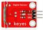
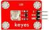
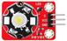
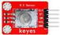
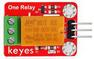
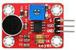
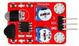
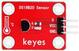

# 清单

|编码|名称|描述|数量|图片|
|-|-|-|-|-|
|1|Keyes模块|keyes 草帽LED白发白模块(焊盘孔) 红色 环保|1||
|2|Keyes模块|keyes 干簧管(焊盘孔) 红色 环保|1||
|3|Keyes模块|keyes 食人鱼LED黄光模块(焊盘孔) 红色 环保|1||
|4|Keyes模块|keyes 3W LED模块(焊盘孔) 红色 环保|1||
|5|Keyes模块|keyes 有源蜂鸣器模块焊盘孔) 红色 环保|1||
|6|Keyes模块|keyes 无源蜂鸣器模块(焊盘孔) 红色 环保|1||
|7|Keyes模块|keyes 旋转编码器模块(焊盘孔) 红色 环保|1||
|8|Keyes模块|keyes 可调电位器模块(焊盘孔) 红色 环保|1||
|9|Keyes模块|keyes 5V 单路继电器模块(焊盘孔) 红色 环保|1||
|10|Keyes模块|keyes 插件RGB(焊盘孔) 红色 环保|1||
|11|keyes传感器|keyes 热敏电阻传感器(焊盘孔) 红色 环保|1||
|12|keyes传感器|keyes 按键传感器(焊盘孔) 红色 环保|1||
|13|keyes传感器|keyes DHT11温湿度传感器(焊盘孔) 红色 环保|1||
|14|keyes传感器|keyes 光敏电阻传感器(焊盘孔) 红色 环保|1||
|15|keyes传感器|keyes 倾斜模块传感器(焊盘孔) 红色 环保|1||
|16|keyes传感器|keyes 麦克风声音传感器(焊盘孔) 红色 环保|1||
|17|keyes传感器|keyes 霍尔传感器(焊盘孔) 红色 环保|1||
|18|keyes传感器|keyes 碰撞传感器(焊盘孔) 红色 环保|1||
|19|keyes传感器|keyes 敲击模块传感器(焊盘孔) 红色 环保|1||
|20|keyes传感器|keyes 避障传感器(焊盘孔) 红色 环保|1||
|21|keyes传感器|keyes LM35温度传感器(焊盘孔) 红色 环保|1||
|22|keyes传感器|keyes 激光头传感器模块(焊盘孔) 红色 环保|1||
|23|keyes传感器|keyes 巡线传感器(焊盘孔) 红色 环保|1||
|24|keyes传感器|keyes 18B20温度传感器(焊盘孔) 红色 环保|1||
